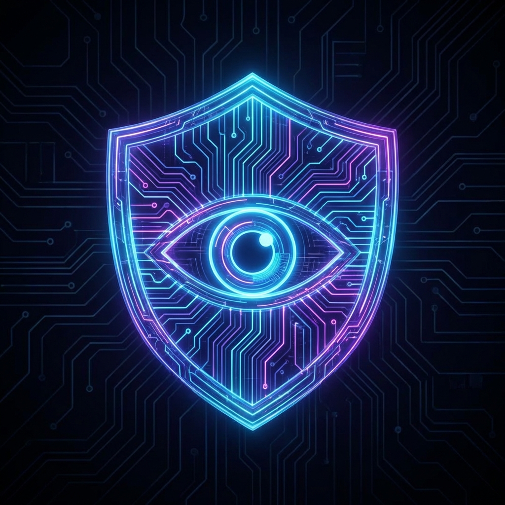
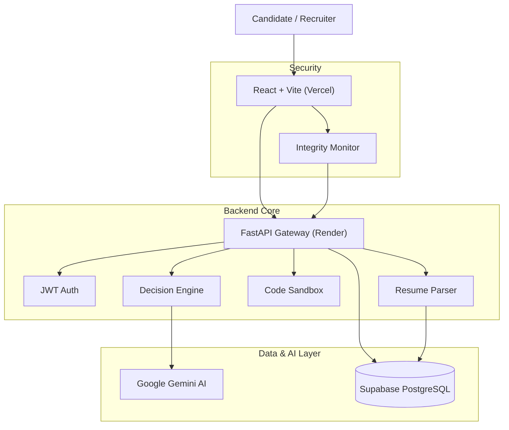

<div align="center">



# 🛡️ Cygnusa Guardian
### Glass-Box Hiring Intelligence

[](https://cygnusa-guardian-el0vtymrt-dakshhhs-projects.vercel.app/)
[](https://cygnusa-guardian.onrender.com)
[](https://github.com/Dakshbumb/Cygnusa-Guardian)
[](https://deepmind.google/technologies/gemini/)

<p align="center">
  <a href="https://cygnusa-guardian-el0vtymrt-dakshhhs-projects.vercel.app/">
    
  </a>
</p>

### *"Because every hiring decision deserves an explanation."*

</div>

---

## 🔮 The Problem: Black-Box Hiring
Traditional AI hiring tools are opaque. Candidates get rejected without knowing why, and recruiters trust scores they can't verify. 

**Cygnusa Guardian** is different. It is an **Explainable AI (XAI)** platform that provides a "Glass-Box" view into the hiring process. Every decision—hire, reject, or conditional—is backed by transparent evidence, exact skill matching, and an audit trail of the AI's reasoning.

---

## ✨ Immersive Features

### 1. 🧠 Smart Resume Gatekeeper
> *Deterministic First, AI Second.*
- **Entity Extraction:** parses skills, education, and experience with regex precision.
- **Fair Scoring:** Calculates match % based on explicit job requirements, not hallucinations.
- **Glass-Box Visuals:** Highlights exactly which keywords triggered a match or miss.

### 2. ⚔️ Dual Assessment Arena
> *Hard Skills meet Soft Skills.*
- **Coding Sandbox:** Real-time Python environment with hidden test cases, time complexity tracking, and anti-cheat constraints.
- **Psychometric Profiling:** Slider-based assessment of resilience, teamwork, and leadership mapped to a radar chart.
- **Scenario MCQs:** Situational judgment tests to evaluate problem-solving under pressure.

### 3. 🛡️ Integrity Shield
> *Trust, but Verify.*
- **Real-Time Proctoring:** Monitors tab switching, copy-pasting, and window blurring.
- **Forensic Logs:** Timestamped audit trail of every suspicious action.
- **Severity Scoring:** Auto-flags candidates who exceed violation thresholds.

### 4. 🤖 Explainable Decision Engine
> *The "Why" behind the "What".*
- **Structured Rationale:** Generates a 3-point reasoning summary for every candidate.
- **Audit Trail:** Saves the **exact prompt** sent to the AI and the **raw response** received.
- **Human-in-the-Loop:** Recommendations (HIRE/NO_HIRE) are just that—recommendations. The recruiter makes the final call with full context.

---

## 🛠️ Architecture & Tech Stack



| Component | Technology | Role |
|-----------|------------|------|
| **Frontend** | React, Tailwind, Framer Motion | Immersive UI & Animations |
| **Backend** | Python FastAPI | Async API & Business Logic |
| **Database** | Supabase (PostgreSQL) | Persistence & Relational Data |
| **AI** | Google Gemini Pro | Reasoning & Decision Generation |
| **Sandbox** | Subprocess/Exec | Safe Code Execution |
| **Deploy** | Vercel (FE) + Render (BE) | Global Content Delivery |

---

## 🚀 Quick Start (Local)

### Backend
```bash
cd backend
python -m venv venv
# Windows: venv\Scripts\activate | Mac: source venv/bin/activate
pip install -r requirements.txt
python main.py
```

### Frontend
```bash
cd frontend
npm install
npm run dev
```

---

## 🧪 Try the Demo
We have seeded the production database with 3 demo profiles to showcase different outcomes:

| Profile | Role | Outcome | Key Feature |
|---------|------|---------|-------------|
| **Alice Chen** | Senior Dev | ✅ HIRE | Perfect code score & high match |
| **Bob Smith** | Junior Dev | ⚠️ CONDITIONAL | Good skills, but high integrity violations |
| **Charlie Davis**| Intern | ❌ NO_HIRE | Missing critical skills, auto-rejected |

<div align="center">
  <br/>
  <a href="https://cygnusa-guardian-el0vtymrt-dakshhhs-projects.vercel.app/login">
    <b>👉 Login as Recruiter (recruiter@demo.com)</b>
  </a>
  <br/>
</div>

---

## 📜 License
MIT © 2026 Cygnusa Guardian. Built for the Future of Hiring.
