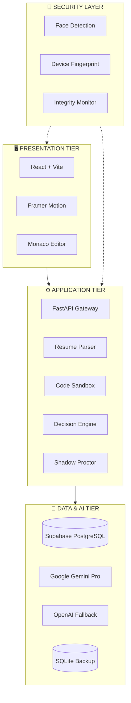

<div align="center">


# 🛡️ CYGNUSA GUARDIAN

### Glass-Box Hiring Intelligence Platform

<br/>

[](https://github.com/Dakshbumb/Cygnusa-Guardian)
[](https://github.com/Dakshbumb/Cygnusa-Guardian)
[](https://github.com/Dakshbumb/Cygnusa-Guardian)
[](https://github.com/Dakshbumb/Cygnusa-Guardian)

<br/>

<p align="center">
  <a href="https://cygnusa-guardian-el0vtymrt-dakshhhs-projects.vercel.app/">
    
  </a>
</p>

### *"Because every hiring decision deserves an explanation."*

---

**45+ Features** · **6 Security Layers** · **100% Transparent AI Decisions** · **Audit-Ready**

</div>

---

## 🔮 The Problem: Black-Box Hiring

> Traditional AI hiring tools are opaque. Candidates get rejected without knowing why, and recruiters trust scores they can't verify.

**Cygnusa Guardian** is the antidote. An **Explainable AI (XAI)** platform providing a complete "Glass-Box" view into hiring. Every decision—HIRE, REJECT, or CONDITIONAL—is backed by:

- ✅ **Transparent Evidence** — See exactly what drove each decision
- ✅ **Counterfactual Explanations** — "What would change the outcome?"
- ✅ **Complete Audit Trail** — Full AI prompt/response logging
- ✅ **Human-in-the-Loop** — AI recommends, humans decide

---

## 🏛️ System Architecture



| Layer | Technologies | Purpose |
|:------|:-------------|:--------|
| **Frontend** | React, Vite, Tailwind, Framer Motion | Immersive UI & Animations |
| **Backend** | Python FastAPI, Pydantic | Async API & Business Logic |
| **Database** | Supabase PostgreSQL + SQLite Fallback | Reliable Data Persistence |
| **AI** | Google Gemini Pro + OpenAI GPT-4 | Explainable Decision Generation |
| **Sandbox** | Subprocess + Timeout Isolation | Secure Code Execution |
| **Deploy** | Vercel (FE) + Render (BE) | Global Delivery |

---

## ✨ Feature Showcase

<table>
<tr>
<td width="50%">

### 🧠 Smart Resume Gatekeeper
> *Deterministic First, AI Second*

- **Entity Extraction** — Parses skills, education, experience
- **Fair Scoring** — Match % based on explicit job requirements
- **Claim Verification** — Flags "led team of 20" for probing
- **Glass-Box Visuals** — See exactly which keywords matched

</td>
<td width="50%">

### ⚔️ Dual Assessment Arena
> *Hard Skills Meet Soft Skills*

- **Coding Sandbox** — Real-time Python with hidden test cases
- **Partial Credit** — Near-miss detection, Levenshtein scoring
- **Psychometric Profiling** — Resilience, teamwork, leadership
- **Scenario MCQs** — Situational judgment under pressure

</td>
</tr>
<tr>
<td width="50%">

### 🛡️ Integrity Shield
> *Trust, But Verify*

- **Real-Time Proctoring** — Tab switch, copy/paste detection
- **Face Detection** — Baseline capture, multi-face alerts
- **Typing Burst Detection** — Flags >40 chars in <300ms
- **Device Fingerprinting** — Unique browser/GPU signature

</td>
<td width="50%">

### 🤖 Explainable Decision Engine
> *The "Why" Behind the "What"*

- **Structured Rationale** — 3-point reasoning summary
- **Counterfactuals** — "If coding was 70%+, outcome = CONDITIONAL"
- **Evidentiary Mapping** — PRIMARY, SUPPORTING, NEGATIVE factors
- **Complete Audit Trail** — Full prompt + raw AI response

</td>
</tr>
</table>

---

## 🔐 Security & Anti-Cheat Matrix

| Layer | Feature | Detection Method |
|:------|:--------|:-----------------|
| 👁️ **Visual** | Face Detection Proctoring | TensorFlow Face-API, baseline comparison |
| 👁️ **Visual** | Multi-Face / No-Face Alerts | Real-time webcam analysis |
| 🖥️ **Browser** | Tab Switch Detection | `visibilitychange` + `blur` events |
| 🖥️ **Browser** | Fullscreen Enforcement | Exit = logged violation |
| ⌨️ **Input** | Copy/Paste Blocking | `e.preventDefault()` on clipboard events |
| ⌨️ **Input** | Typing Burst Detection | Timestamp analysis threshold |
| ⌨️ **Input** | Keyboard Shortcuts Blocked | Ctrl+C/V/X, Alt+Tab intercepted |
| 🔧 **Code** | Banned Import Detection | `os, subprocess, socket, requests` blocked |
| 🔧 **Code** | Execution Timeout | 10 second max runtime |
| 🆔 **Identity** | Device Fingerprinting | Browser, GPU, Canvas, Timezone hash |
| 🎯 **Verification** | Shadow Probe Interview | AI follow-up: "Why hash map on line 12?" |
| ⚖️ **Scoring** | Violation Severity Weights | Critical(10), High(5), Medium(2), Low(1) |

---

## 📊 Grading Accuracy System

<table>
<tr>
<td width="60%">

### Partial Credit Scoring
```python
# Near-miss detection with tolerance
if abs(expected - actual) / expected <= 0.01:  # 1%
    return "FULL_CREDIT"
elif abs(expected - actual) / expected <= 0.05:  # 5%
    return "PARTIAL_CREDIT_HIGH"
elif abs(expected - actual) / expected <= 0.10:  # 10%
    return "PARTIAL_CREDIT_LOW"

# String similarity via Levenshtein
similarity = 1 - (distance / max_len)
if similarity >= 0.50:
    return f"PARTIAL: {similarity * 100}%"
```

</td>
<td width="40%">

### Competency Mapping
| Area | Assessment |
|:-----|:-----------|
| Machine Learning | MCQ + Code |
| Data Structures | Code + Probe |
| Frontend (React) | MCQ |
| System Design | Text + MCQ |
| Databases | MCQ + Code |

</td>
</tr>
</table>

### Decision Thresholds
| Outcome | Criteria |
|:--------|:---------|
| ✅ **AUTO-HIRE** | Coding ≥80% + Resume ≥70% |
| ⚠️ **CONDITIONAL** | Mixed signals, needs human review |
| ❌ **AUTO-REJECT** | Coding <30% or critical skill gaps |

---

## 🔍 Logic Transparency Features

```
┌─────────────────────────────────────────────────────────────────────────────┐
│                         TRANSPARENCY LAYER                                  │
├─────────────────────────────────────────────────────────────────────────────┤
│                                                                             │
│  📊 EVIDENTIARY MAPPING           🔄 COUNTERFACTUAL ENGINE                 │
│  ┌────────────────────────┐       ┌────────────────────────┐               │
│  │ 🟢 PRIMARY_DRIVER      │       │ "If coding was 70%+,   │               │
│  │ 🟡 SUPPORTING          │       │  outcome would be      │               │
│  │ 🔴 NEGATIVE            │       │  CONDITIONAL instead   │               │
│  │ ⚪ NEUTRAL             │       │  of NO_HIRE"           │               │
│  └────────────────────────┘       └────────────────────────┘               │
│                                                                             │
│  📝 REASONING ARRAY               🧬 COGNITIVE PROFILING                   │
│  ┌────────────────────────┐       ┌────────────────────────┐               │
│  │ 1. Strong coding (85%) │       │ • Systematic Solver    │               │
│  │ 2. Relevant experience │       │ • Creative Innovator   │               │
│  │ 3. Minor integrity flag│       │ • Analytical Thinker   │               │
│  └────────────────────────┘       └────────────────────────┘               │
│                                                                             │
│  📜 AUDIT TRAIL                   ⏱️ FORENSIC TIMELINE                     │
│  ┌────────────────────────┐       ┌────────────────────────┐               │
│  │ Full Prompt → AI       │       │ RESUME → CODE → MCQ →  │               │
│  │ Raw Response ← AI      │       │ TEXT → INTEGRITY →     │               │
│  │ Model: gemini-pro      │       │ FINAL DECISION         │               │
│  │ Timestamp: ISO8601     │       │                        │               │
│  └────────────────────────┘       └────────────────────────┘               │
│                                                                             │
└─────────────────────────────────────────────────────────────────────────────┘
```

---

## 🎨 User Experience

| Feature | Description |
|:--------|:------------|
|  **Dark Theme** | Premium aesthetic with `#0a0a0a` base, teal accents |
|  **Framer Motion** | Smooth page transitions, staggered lists, hover effects |
|  **Responsive Grid** | Mobile → Tablet → Desktop breakpoints |
|  **Skeleton Loaders** | Shimmer placeholders for all async content |
|  **Progress Stepper** | Visual assessment flow with completion states |
|  **Decision Cards** | Rich visualization with scores, evidence, actions |
|  **Monaco Editor** | Syntax highlighting, multi-language code editor |
|  **Code Splitting** | React.lazy() + Suspense for optimized bundles |
|  **Error Boundaries** | Graceful error display with retry actions |
|  **Case File Export** | Download complete candidate dossier as JSON |

---

## 🚀 Quick Start

### Backend
```bash
cd backend
python -m venv venv
# Windows: venv\Scripts\activate
# Mac/Linux: source venv/bin/activate
pip install -r requirements.txt
python main.py
```

### Frontend
```bash
cd frontend
npm install
npm run dev
```

```env
# Backend (.env)
GEMINI_API_KEY=your_gemini_key
OPENAI_API_KEY=your_openai_key
SUPABASE_URL=your_supabase_url
SUPABASE_KEY=your_supabase_key

# Frontend (.env)
VITE_API_URL=http://localhost:8000
VITE_SUPABASE_URL=your_supabase_url
VITE_SUPABASE_ANON_KEY=your_supabase_anon_key
```

---

## 🧪 Try the Live Demo

We've seeded the production database with demo profiles showcasing different outcomes:

| Profile | Role | Outcome | What It Demonstrates |
|:--------|:-----|:--------|:---------------------|
| **Alice Chen** | Senior Dev | ✅ HIRE | Perfect code + high resume match |
| **Bob Smith** | Junior Dev | ⚠️ CONDITIONAL | Good skills, integrity violations |
| **Charlie Davis** | Intern | ❌ NO_HIRE | Missing critical skills, auto-rejected |

<div align="center">

<br/>

<a href="https://cygnusa-guardian-el0vtymrt-dakshhhs-projects.vercel.app/">
  
</a>

<br/><br/>

<a href="https://cygnusa-guardian-el0vtymrt-dakshhhs-projects.vercel.app/">
  
</a>

</div>

---

## 📁 Project Structure

```
cygnusa-guardian/
├── 📂 frontend/
│   ├── 📂 src/
│   │   ├── 📂 components/
│   │   │   ├── 📂 dashboard/          # Recruiter dashboard
│   │   │   ├── 📂 ui/                 # Reusable UI (Skeleton, etc.)
│   │   │   ├── IntegrityMonitor.jsx   # Proctoring system
│   │   │   ├── ShadowProber.jsx       # AI follow-up interviewer
│   │   │   └── WebcamProctor.jsx      # Face detection
│   │   ├── 📂 pages/
│   │   │   ├── CandidateFlow.jsx      # Assessment orchestration
│   │   │   ├── RecruiterDashboard.jsx # Candidate management
│   │   │   └── HomePage.jsx           # Landing page
│   │   └── 📂 utils/
│   │       ├── api.js                 # Backend API client
│   │       └── deviceFingerprint.js   # Security fingerprinting
│   └── package.json
│
├── 📂 backend/
│   ├── main.py                        # FastAPI entry point
│   ├── code_executor.py               # Secure sandbox
│   ├── decision_engine.py             # AI decision logic
│   ├── resume_parser.py               # Resume processing
│   ├── models.py                      # Pydantic models
│   ├── database.py                    # Database operations
│   └── requirements.txt
│
├── 📂 docs/
│   ├── ARCHITECTURE.md                # System design
│   ├── FEATURES.md                    # Complete feature catalog
│   ├── GRADING_ACCURACY.md            # Scoring algorithms
│   ├── API_REFERENCE.md               # Endpoint documentation
│   └── SECURITY_ANTICHEAT.md          # Security implementation
│
└── 📂 assets/
    └── logo.png                       # Cygnusa Guardian logo
```


---

<div align="center">

**Built with 💜 for the Future of Hiring**

<br/>

[](LICENSE)

MIT © 2026 Cygnusa Guardian

</div>
