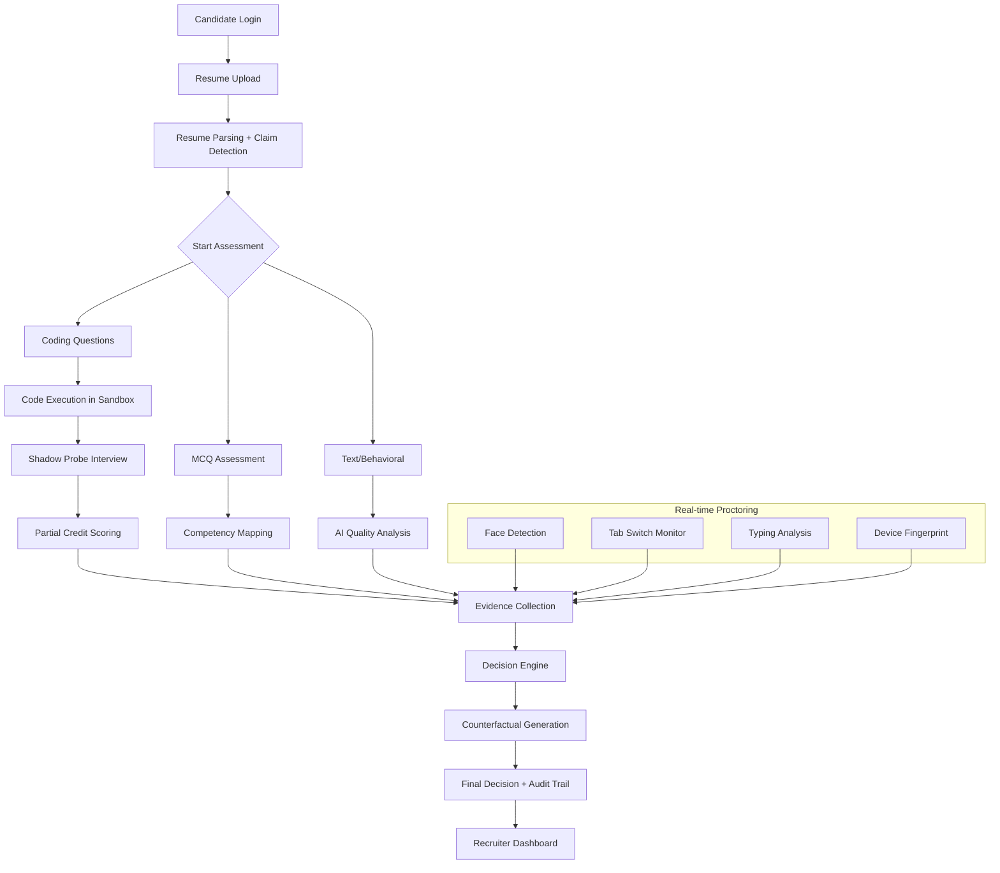

# 🏗️ Cygnusa Guardian - System Architecture

## Executive Summary

Cygnusa Guardian is an **AI-powered, explainable hiring platform** that eliminates black-box decision-making in technical recruitment. Every hiring decision is backed by auditable evidence, real-time proctoring, and transparent reasoning.

---

## 📐 Three-Tier Architecture

```
┌─────────────────────────────────────────────────────────────────────────┐
│                        PRESENTATION TIER                                │
│                      (React + Vite Frontend)                            │
│  ┌─────────────┐  ┌─────────────┐  ┌─────────────┐  ┌─────────────┐    │
│  │  Candidate  │  │  Recruiter  │  │  Proctoring │  │   Decision  │    │
│  │    Flow     │  │  Dashboard  │  │   Monitor   │  │    Cards    │    │
│  └─────────────┘  └─────────────┘  └─────────────┘  └─────────────┘    │
└───────────────────────────────┬─────────────────────────────────────────┘
                                │ REST API (JSON)
                                ▼
┌─────────────────────────────────────────────────────────────────────────┐
│                        APPLICATION TIER                                 │
│                    (FastAPI + Python Backend)                           │
│  ┌─────────────┐  ┌─────────────┐  ┌─────────────┐  ┌─────────────┐    │
│  │   Resume    │  │    Code     │  │   Shadow    │  │  Decision   │    │
│  │   Parser    │  │   Sandbox   │  │   Proctor   │  │   Engine    │    │
│  └─────────────┘  └─────────────┘  └─────────────┘  └─────────────┘    │
└───────────────────────────────┬─────────────────────────────────────────┘
                                │
                                ▼
┌─────────────────────────────────────────────────────────────────────────┐
│                          DATA TIER                                      │
│  ┌─────────────┐  ┌─────────────┐  ┌─────────────┐  ┌─────────────┐    │
│  │  Supabase   │  │   SQLite    │  │   Gemini    │  │   OpenAI    │    │
│  │ (Auth/Store)│  │  (Fallback) │  │     AI      │  │   Fallback  │    │
│  └─────────────┘  └─────────────┘  └─────────────┘  └─────────────┘    │
└─────────────────────────────────────────────────────────────────────────┘
```

---

## 🔄 Assessment Workflow



---

## 🧩 Component Architecture

### Frontend Components

| Component | Purpose | Key Features |
|-----------|---------|--------------|
| `CandidateFlow.jsx` | Assessment orchestration | Progress stepper, section routing |
| `IntegrityMonitor.jsx` | Proctoring | Face detection, violation logging |
| `ShadowProber.jsx` | AI interviewer | Follow-up questions, verification |
| `RecruiterDashboard.jsx` | Candidate management | Filtering, decision cards |
| `DecisionCard.jsx` | Explainable decisions | Evidence mapping, counterfactuals |
| `Skeleton.jsx` | UX loading states | Shimmer animations |

### Backend Services

| Service | Responsibility | Technology |
|---------|---------------|------------|
| `main.py` | API orchestration | FastAPI |
| `code_executor.py` | Secure code sandbox | Subprocess + timeout |
| `decision_engine.py` | AI decision + transparency | Gemini + fallback rules |
| `resume_parser.py` | Skill extraction + claims | Regex + NLP |
| `models.py` | Data structures | Pydantic |

---

## 🔐 Security Architecture

```
┌──────────────────────────────────────────────────────────────────┐
│                    SECURITY LAYER                                │
│  ┌────────────────┐  ┌────────────────┐  ┌────────────────┐     │
│  │   JWT Auth     │  │ Device         │  │  Fullscreen    │     │
│  │   (Supabase)   │  │ Fingerprint    │  │  Enforcement   │     │
│  └────────────────┘  └────────────────┘  └────────────────┘     │
│                                                                  │
│  ┌────────────────┐  ┌────────────────┐  ┌────────────────┐     │
│  │   Face ID      │  │  Tab Switch    │  │  Typing Burst  │     │
│  │   Baseline     │  │  Detection     │  │  Detection     │     │
│  └────────────────┘  └────────────────┘  └────────────────┘     │
│                                                                  │
│  ┌────────────────┐  ┌────────────────┐  ┌────────────────┐     │
│  │  Copy/Paste    │  │ Context Menu   │  │  Keyboard      │     │
│  │  Blocking      │  │ Blocking       │  │  Shortcuts     │     │
│  └────────────────┘  └────────────────┘  └────────────────┘     │
└──────────────────────────────────────────────────────────────────┘
```

---

## 📊 Data Flow

### Evidence Collection Pipeline

```
Candidate Action → Frontend Capture → API Endpoint → Evidence Model → Database
       ↓               ↓                  ↓              ↓             ↓
   Code Submit    JS Event Handler    /api/submit    Pydantic      JSON Store
   MCQ Answer     React State         /api/mcq       Validation    Supabase
   Violation      IntegrityMonitor    /api/violation TypedDict     SQLite
   Snapshot       Canvas Capture      /api/snapshot  Base64        File Store
```

### Decision Generation Pipeline

```
Evidence Summary → Deterministic Rules → AI Enhancement → Counterfactuals → Final Decision
       ↓                  ↓                    ↓               ↓               ↓
   Pre-calculated    Auto HIRE/REJECT     Gemini Pro      What-if logic   Audit Trail
   No AI needed      if thresholds met    Nuanced cases   Transparency    Full trace
```

---

## 🚀 Deployment Architecture

```
┌─────────────────────────────────────────────────────────────────┐
│                        VERCEL                                   │
│                   (Frontend Hosting)                            │
│  ┌─────────────────────────────────────────────────────────┐   │
│  │  React App (Static Build)                                │   │
│  │  - Code splitting, lazy loading                          │   │
│  │  - CDN-cached assets                                     │   │
│  └─────────────────────────────────────────────────────────┘   │
└───────────────────────────┬─────────────────────────────────────┘
                            │ HTTPS
                            ▼
┌─────────────────────────────────────────────────────────────────┐
│                        RENDER                                   │
│                   (Backend Hosting)                             │
│  ┌─────────────────────────────────────────────────────────┐   │
│  │  FastAPI Server (Python 3.11)                            │   │
│  │  - Auto-scaling, health checks                           │   │
│  │  - Environment variables for secrets                     │   │
│  └─────────────────────────────────────────────────────────┘   │
└───────────────────────────┬─────────────────────────────────────┘
                            │
                            ▼
┌─────────────────────────────────────────────────────────────────┐
│                       SUPABASE                                  │
│               (Auth + Database + Storage)                       │
│  ┌──────────────┐  ┌──────────────┐  ┌──────────────┐          │
│  │  PostgreSQL  │  │  Auth (JWT)  │  │  Storage     │          │
│  │  Database    │  │  Sessions    │  │  (Snapshots) │          │
│  └──────────────┘  └──────────────┘  └──────────────┘          │
└─────────────────────────────────────────────────────────────────┘
```

---

## 📁 Project Structure

```
cygnusa-guardian/
├── frontend/
│   ├── src/
│   │   ├── components/
│   │   │   ├── dashboard/        # Recruiter dashboard components
│   │   │   ├── ui/               # Reusable UI (Skeleton, etc.)
│   │   │   ├── IntegrityMonitor.jsx
│   │   │   ├── ShadowProber.jsx
│   │   │   └── WebcamProctor.jsx
│   │   ├── pages/
│   │   │   ├── CandidateFlow.jsx
│   │   │   └── RecruiterDashboard.jsx
│   │   ├── utils/
│   │   │   ├── api.js
│   │   │   └── deviceFingerprint.js
│   │   └── App.jsx
│   └── package.json
│
├── backend/
│   ├── main.py                   # FastAPI entry point
│   ├── code_executor.py          # Secure sandbox
│   ├── decision_engine.py        # AI decision logic
│   ├── resume_parser.py          # Resume processing
│   ├── models.py                 # Pydantic models
│   ├── database.py               # Database operations
│   └── requirements.txt
│
└── docs/
    ├── ARCHITECTURE.md           # This file
    ├── GRADING_ACCURACY.md
    ├── LOGIC_TRANSPARENCY.md
    ├── SECURITY_ANTICHEAT.md
    ├── USER_EXPERIENCE.md
    └── FEATURES.md
```

---

## 🔗 API Endpoints

| Endpoint | Method | Purpose |
|----------|--------|---------|
| `/api/login` | POST | Authenticate user |
| `/api/candidates` | GET | List all candidates |
| `/api/candidate/{id}` | GET | Get candidate details |
| `/api/submit-code` | POST | Execute code in sandbox |
| `/api/submit-mcq` | POST | Submit MCQ answers |
| `/api/generate-probe` | POST | Generate shadow probe |
| `/api/violation` | POST | Log integrity violation |
| `/api/snapshot` | POST | Upload webcam snapshot |
| `/api/decision/{id}` | GET | Get final decision |
| `/api/export-case/{id}` | GET | Download case file |

---

## ✅ Architecture Evaluation Alignment

| Criteria | Implementation | Score Target |
|----------|---------------|--------------|
| 3-Tier Separation | Frontend → Backend → Data | ✅ 30% |
| Secure Code Sandbox | Subprocess + timeout + banned imports | ✅ |
| AI Integration | Gemini Pro + OpenAI fallback | ✅ |
| Audit Trail | Full prompt/response logging | ✅ |
| Scalable Design | Stateless API, external DB | ✅ |
